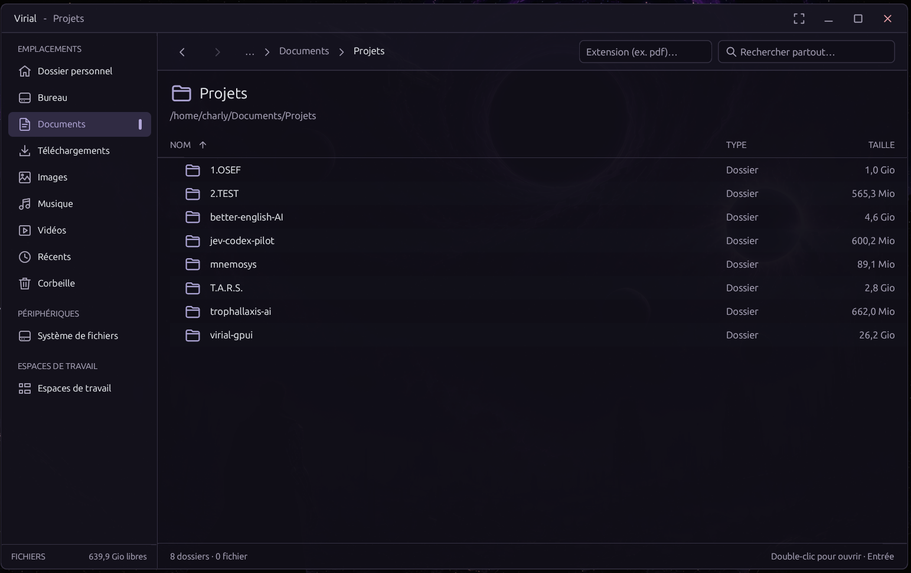
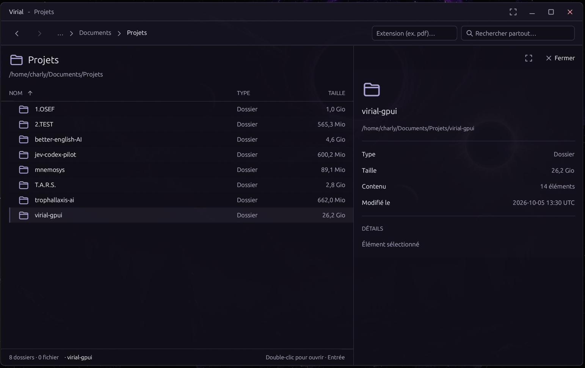
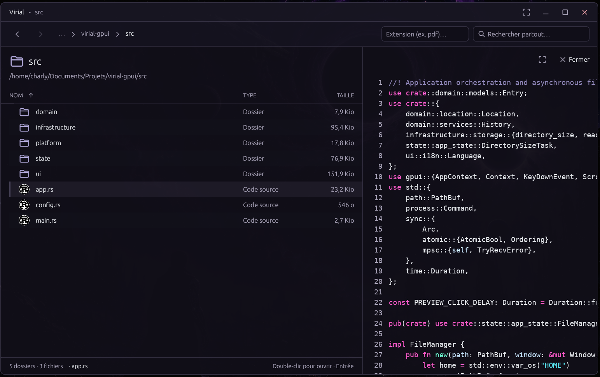

# Virial
---

Virial is a Linux file manager for browsing local folders, mounted drives, and recent files. Navigate with the sidebar and breadcrumbs, organize related folders into persistent workspaces, and preview supported images, PDFs, and text files. The browser also supports common file actions, including selecting, copying, moving, renaming, and trashing files.

Virial adapts its interface language to the system language. English is used when the system language is not supported.

Drag files or folders onto a folder in the list, a sidebar location, or a breadcrumb to move them there. The preview closes and the sidebar reappears while dragging. Dragging a selected item moves the entire selection; hold Ctrl to copy instead. Existing destination names are never overwritten, and moves support `Ctrl+Z`. During transfers, a progress panel shows undo preparation, copying or moving, and finalization. Local transfers show a percentage for each phase, including progress within large files; preparation and ZIP transfers show an activity indicator when the total is not available.

Local moves on the same filesystem use a rename. Copies, moves across filesystems, and undo snapshots use accelerated Linux copying when available, including copy-on-write cloning on compatible filesystems, with an automatic fallback. Progress and undo checks remain active; speed depends on the drives and filesystem.

Drag local files or folders out of Virial onto another application to open, attach, or import them. External drops copy files and keep the originals on X11 and Wayland. ZIP members support dragging within Virial only.

USB drives and other removable storage appear automatically under **Devices**, including their filesystem labels, sizes, and mount status. Click a volume to browse it; unmounted volumes are mounted first. The × button unmounts one volume, and the eject button safely removes the entire drive after unmounting all its volumes. Operations fail if a volume is in use. If the current device is disconnected or unmounted, Virial returns to Home. Device management requires the UDisks2 system service (`udisks2` on Debian/Ubuntu); desktop authorization dialogs may appear when needed. Encrypted volume unlocking is handled by your desktop.

Open **Trash** in the sidebar to see deleted files and folders, including items on mounted drives. Select items and click **Restore** in the toolbar or context menu to move them back to their original locations. Existing files are never overwritten; if the original parent folder is missing, recreate it before restoring. Restoration also works after restarting Virial and can be undone with `Ctrl+Z`.

Single-click a file or folder to show its preview and details. The preview appears after the double-click interval, so double-clicking opens the item without first showing its preview. The left navigation sidebar gently collapses while a preview is open and returns when the preview closes, freeing space for the file list. Drag the left edge of the preview panel to adjust its width, or use the expand button for a larger view that keeps the window title bar accessible in windowed mode. Virial remembers the preview width and the window size, position, and maximized or fullscreen state when you close it. Window placement under Wayland is controlled by the compositor. Double-click to open the item and hide the details. Navigating to another folder or clicking empty space hides the details; single-click an item to show them again.

PDF previews show the first page, including PDF files inside ZIP archives, and support the expanded view. They require `pdftoppm` from Poppler (`poppler-utils` on Debian/Ubuntu). PDFs up to 20 MiB are rendered locally; invalid, password-protected, or slow files show the unavailable-preview message.

Press `F2` or choose **Rename…** to edit an item's name directly in its row. The file name is selected without its final extension; folder names are selected in full. Press Enter to save, or Escape or click elsewhere to cancel. The extension remains editable.

Image previews show the image format and pixel dimensions below the image, alongside file size and modification date.

Image previews include **Convert image…** and **Remove background…** buttons, also available in the expanded view. Convert PNG, JPEG, WebP, GIF, or BMP images to PNG, JPEG, or WebP and choose an output file name. Animated images export their first frame; JPEG composites transparency onto white. PNG uses high lossless compression and omits unnecessary alpha channels; JPEG uses quality 75 and WebP uses lossy quality 80 with transparency preserved. File size depends on image content and format: converting a JPEG to lossless PNG can still produce a larger file. SVG processing is not supported. Exports create a new file beside the original (including inside ZIP archives), never overwrite an existing file, and support `Ctrl+Z`. Processing runs in the background and accepts images up to 20 MiB and 32 megapixels. Image exports are disabled in Trash.

Press `Ctrl+Z` in the browser to undo the latest file or workspace change. Virial keeps the last 20 changes across restarts, including copy, move, rename, Trash, creation, compression, and ZIP edits. Undo refuses to discard files changed since the action or overwrite conflicting contents. Saved contents are stored under `$XDG_DATA_HOME/virial/undo` (default: `~/.local/share/virial/undo`), so recording large files or folders can need additional disk space; copy-on-write snapshots share unchanged blocks when supported. Undoing Trash restores saved contents; the desktop Trash retains its copy. Let an operation finish before closing the window.

Double-click a ZIP archive to browse it like a folder, using breadcrumbs and the usual navigation keys. Preview supported images, PDFs, and text, rename files or entire folders, and use cut/paste or drag-and-drop to move items within a ZIP, between ZIPs, or between a ZIP and a local folder. Ctrl-drag and copy/paste copy items. You can also create files and folders inside a ZIP. Changes are saved directly to the archive; existing destination names are never overwritten. Opening a member in another application uses a temporary copy kept until Virial closes; external edits are not saved back to the ZIP. Nested ZIP browsing and moving members to the desktop Trash are not supported. Archives containing encrypted members, links, or special files cannot be modified; encrypted members and links cannot be extracted.

Code previews use syntax highlighting, a monospace font, and line numbers. Source indentation and blank lines are preserved, with tabs displayed at four-column stops. Use horizontal scrolling or Shift + mouse wheel to read long lines. Supported languages include Rust, Python, JavaScript, TypeScript, C/C++, HTML, CSS, JSON, TOML, and shell scripts; unrecognized text files keep a plain text preview. Text and code previews show up to the first 64 KiB of the file.

Code file icons use logos for popular languages and frameworks. Images, music, video, and other common formats use distinct category icons. See [icon sources and notices](assets/icons/README.md).

Use the extension field in the toolbar to filter files in the current folder or recent files. Enter `pdf` or `.pdf`; matching is case-insensitive and uses the final extension (`gz` for `archive.tar.gz`). Folders stay visible for navigation. The filter stays active when navigating; clear the field to show all files again.

Press `Ctrl+P` to search accessible locations as you type. Virial searches from your home folder and does not require zoxide or a prebuilt search index.

---

## See Virial in action





---

## Quickstart

### Prerequisites

On Debian or Ubuntu, install the native libraries and build tools used by GPUI:

```sh
sudo apt update && sudo apt install -y build-essential pkg-config libfontconfig1-dev libwayland-dev libx11-xcb-dev libxkbcommon-dev libxkbcommon-x11-dev libasound2-dev libvulkan-dev udisks2 poppler-utils
```

Rust stable (1.85 or newer) and Cargo are also required. If they are not installed, install the toolchain with:

```sh
curl --proto '=https' --tlsv1.2 -sSf https://sh.rustup.rs | sh
```

### Run without installing

From the project directory, build and launch Virial directly:

```sh
cargo run --release
```

This runs the app from the current checkout. On first launch, Virial registers its desktop launcher and icon under `$XDG_DATA_HOME` (default: `~/.local/share`). To register a downloaded executable, run `./virial-gpui --install-desktop`.

### Install on this machine

From the project directory, build and install the executable, desktop launcher, and icon under your home directory:

```sh
./install.sh
```

### Tests and performance

GitHub Actions runs the tests, release build, and filesystem performance check on Ubuntu. Run the same checks locally with:

```sh
cargo test --locked
cargo build --release --locked
cargo test --release --locked infrastructure::performance::filesystem_performance -- --ignored --exact --nocapture --test-threads=1
```

The performance smoke test measures listing and searching 5,000 files across 50 folders; each operation must have a median below two seconds.

Measure copying and moving a 64 MiB file plus 1,000 small files, including progress and undo recording, with:

```sh
cargo test --release --locked infrastructure::performance::transfer_performance -- --ignored --exact --nocapture --test-threads=1
```

This benchmark reports warm-cache medians on the current filesystem; it has no hardware-dependent time limit.

### Optional background removal

To install Virial with local [rembg](https://github.com/danielgatis/rembg) background removal, use one command from the project directory:

```sh
./install.sh --with-background-removal
```

This requires Python 3.11–3.13 with venv support (`python3-venv` on Debian/Ubuntu) and internet access. The installer sets up rembg under `$XDG_DATA_HOME/virial/rembg-venv` (default: `~/.local/share/virial/rembg-venv`).

Background removal creates a transparent PNG. The first removal downloads the `u2netp` model; subsequent removals work offline with the cached model. Images are processed on your machine.
