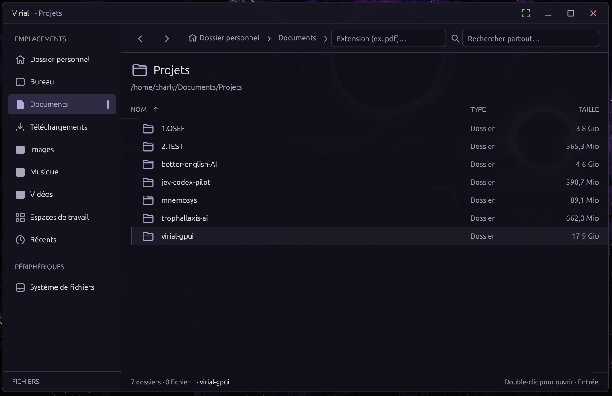
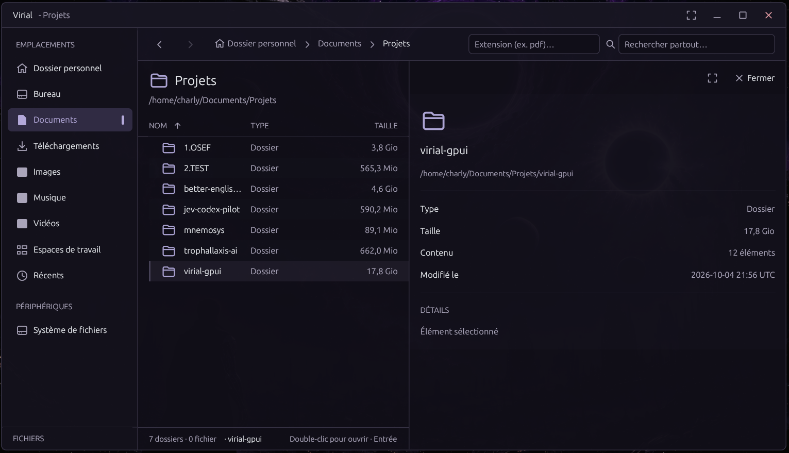
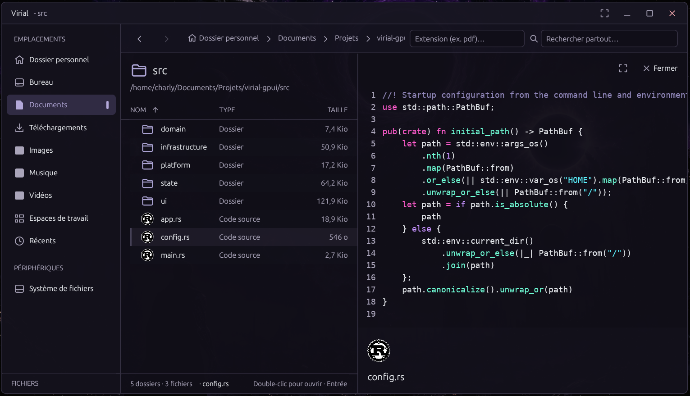

# Virial
---

Virial is a Linux file manager for browsing local folders, mounted drives, and recent files. Navigate with the sidebar and breadcrumbs, organize related folders into persistent workspaces, and preview supported images and text files. The browser also supports common file actions, including selecting, copying, moving, renaming, and trashing files.

Virial adapts its interface language to the system language. English is used when the system language is not supported.

USB drives and other removable storage appear automatically under **Devices**, including their filesystem labels, sizes, and mount status. Click a volume to browse it; unmounted volumes are mounted first. The × button unmounts one volume, and the eject button safely removes the entire drive after unmounting all its volumes. Operations fail if a volume is in use. If the current device is disconnected or unmounted, Virial returns to Home. Device management requires the UDisks2 system service (`udisks2` on Debian/Ubuntu); desktop authorization dialogs may appear when needed. Encrypted volume unlocking is handled by your desktop.

The sidebar footer shows the available space on the filesystem containing your home folder.

Single-click a file or folder to show its preview and details. The preview side panel takes 48% of the window width and resizes with the window, with an expand button for a larger view. Double-click to open the item and hide the details. Navigating to another folder or clicking empty space hides the details; single-click an item to show them again.

Press `F2` or choose **Rename…** to edit an item's name directly in its row. The file name is selected without its final extension; folder names are selected in full. Press Enter to save, or Escape or click elsewhere to cancel. The extension remains editable.

Double-click a ZIP archive to browse it like a folder, using breadcrumbs and the usual navigation keys. Preview supported images and text, rename files or entire folders, and use cut/paste or drag-and-drop to move items within a ZIP, between ZIPs, or between a ZIP and a local folder. Ctrl-drag and copy/paste copy items. You can also create files and folders inside a ZIP. Changes are saved directly to the archive; existing destination names are never overwritten. Opening a member in another application uses a temporary copy kept until Virial closes; external edits are not saved back to the ZIP. Nested ZIP browsing and moving members to the desktop Trash are not supported. Archives containing encrypted members, links, or special files cannot be modified; encrypted members and links cannot be extracted.

Code previews keep the application's dark background and use cyberpunk syntax colors, including neon cyan, magenta, and violet, with a monospace font and line numbers. Source indentation and blank lines are preserved, with tabs displayed at four-column stops. Use horizontal scrolling or Shift + mouse wheel to read long lines. Supported languages include Rust, Python, JavaScript, TypeScript, C/C++, HTML, CSS, JSON, TOML, and shell scripts; unrecognized text files keep a plain text preview. Text and code previews show up to the first 64 KiB of the file.

Code file icons use official logos for Python, TypeScript, React (`.jsx` and `.tsx`), Rust, HTML, CSS, Sass (`.scss` and `.sass`), and C++, plus community marks for JavaScript and C. Images, music, and common video formats use distinct category icons. Other formats, including JSON, configuration files, shell scripts, PDF, and Markdown, also use distinct category icons. Logos retain their colors in the file list, search results, and details panel. Extension matching is case-insensitive. See [icon sources and notices](assets/icons/README.md).

Use the extension field in the toolbar to filter files in the current folder or recent files. Enter `pdf` or `.pdf`; matching is case-insensitive and uses the final extension (`gz` for `archive.tar.gz`). Folders stay visible for navigation. The filter stays active when navigating; clear the field to show all files again.

Press `Ctrl+P` to open the global path picker. It searches accessible locations as you type and ranks fuzzy matches in file names and paths, making it a zoxide-like way to jump quickly to a folder or file. Virial performs this search itself, so it does not require zoxide or a prebuilt search index; arrow keys move through results and Enter opens the selection.

---

## See Virial in action





---

## Quickstart

### Prerequisites

On Debian or Ubuntu, install the native libraries and build tools used by GPUI:

```sh
sudo apt update && sudo apt install -y build-essential pkg-config libfontconfig1-dev libwayland-dev libx11-xcb-dev libxkbcommon-dev libxkbcommon-x11-dev libasound2-dev libvulkan-dev udisks2
```

Rust stable (1.85 or newer) and Cargo are also required. If they are not installed, install the toolchain with:

```sh
curl --proto '=https' --tlsv1.2 -sSf https://sh.rustup.rs | sh
```

### Run without installing

From the project directory, build and launch Virial directly:

```sh
cargo run --release
```

This runs the app from the current checkout without installing a permanent copy of the executable.

On first launch, Virial registers its embedded logo and desktop launcher in `$XDG_DATA_HOME` (default: `~/.local/share`), and refreshes KDE's application cache when available. Window icons use the registered desktop launcher and application identity on X11 and Wayland. This also works when running a downloaded executable directly. The launcher follows the executable's location the next time you run it.

To register a downloaded executable before opening the app, run `./virial-gpui --install-desktop`. This needs no graphical session. A raw Linux executable may still have a generic file icon in Downloads; open Virial from the application menu to use its branded launcher.

### Install on this machine

From the project directory, build and install the executable, desktop launcher, and icon under your home directory:

```sh
./install.sh
```
