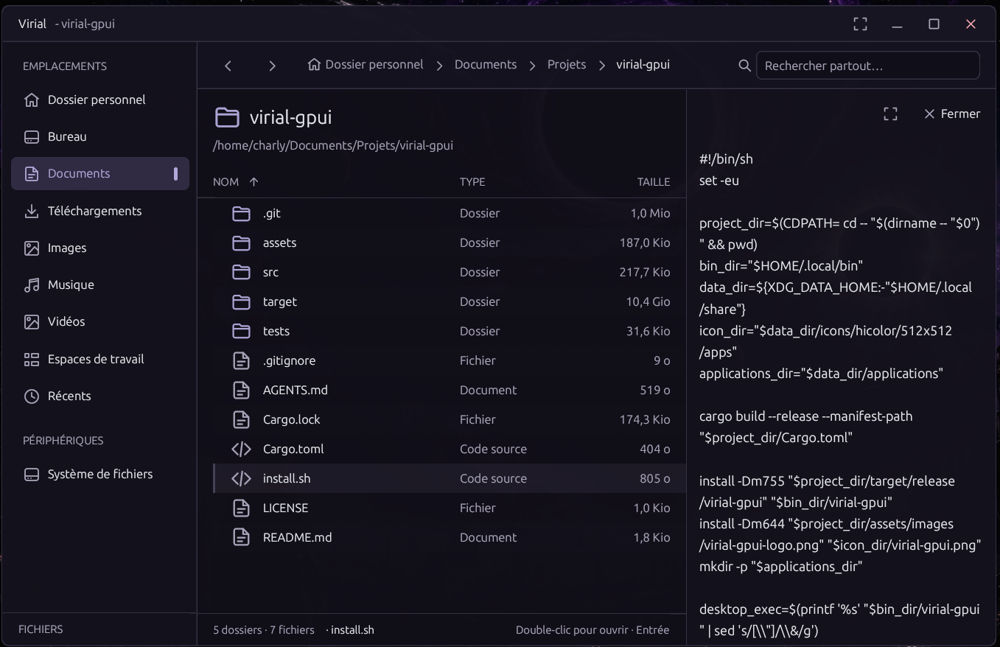

# Virial
---

Virial is a Linux file manager for browsing local folders, mounted drives, and recent files. Navigate with the sidebar and breadcrumbs, organize related folders into persistent workspaces, and preview supported images and text files. The browser also supports common file actions, including selecting, copying, moving, renaming, and trashing files.

Virial adapts its interface language to the system language. English is used when the system language is not supported.

Single-click a file or folder to show its details. Double-click to open it and hide the details. Navigating to another folder or clicking empty space hides the details; single-click an item to show them again.

Press `Ctrl+P` to open the global path picker. It searches accessible locations as you type and ranks fuzzy matches in file names and paths, making it a zoxide-like way to jump quickly to a folder or file. Virial performs this search itself, so it does not require zoxide or a prebuilt search index; arrow keys move through results and Enter opens the selection.

---

## See Virial in action



---

## Quickstart

### Prerequisites

On Debian or Ubuntu, install the native libraries and build tools used by GPUI:

```sh
sudo apt update && sudo apt install -y build-essential pkg-config libfontconfig1-dev libwayland-dev libx11-xcb-dev libxkbcommon-dev libxkbcommon-x11-dev libasound2-dev libvulkan-dev
```

Rust stable (1.85 or newer) and Cargo are also required. If they are not installed, install the toolchain with:

```sh
curl --proto '=https' --tlsv1.2 -sSf https://sh.rustup.rs | sh
```

### Run without installing

From the project directory, build and launch Virial directly:

```sh
cargo run --release
```

This runs the app from the current checkout without installing a permanent copy of the executable.

On launch, Virial registers its embedded logo and desktop launcher in `$XDG_DATA_HOME` (default: `~/.local/share`) so the application menu and dock can display its icon, including when running a downloaded executable directly. The launcher follows the executable's location the next time you run it.

### Install on this machine

From the project directory, build and install the executable, desktop launcher, and icon under your home directory:

```sh
./install.sh
```
