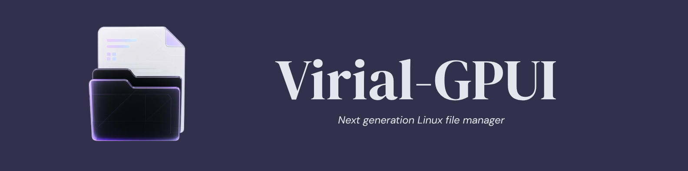

# Virial
---

Virial is a Linux file manager for browsing and organizing files.<br>
Browse local folders, mounted drives, and recent files.<br>
Move between locations using the sidebar and breadcrumbs.<br>
Search accessible folders by file name or path.<br>
Group folders into workspaces for quick access.<br>
Preview supported images and text files before opening them.<br>
Select, copy, move, rename, and trash files from the browser.<br>
Keyboard shortcuts cover navigation and common file actions.

## Quickstart

### Install

```sh
./install.sh
```

### Run

```sh
cargo run --release
```
